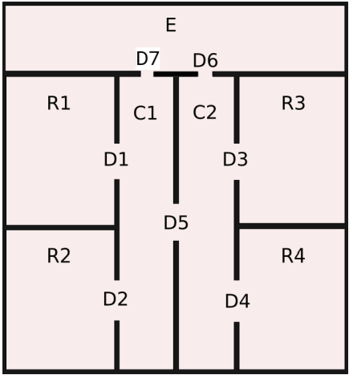
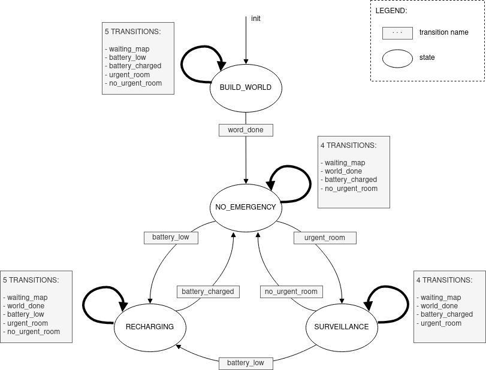
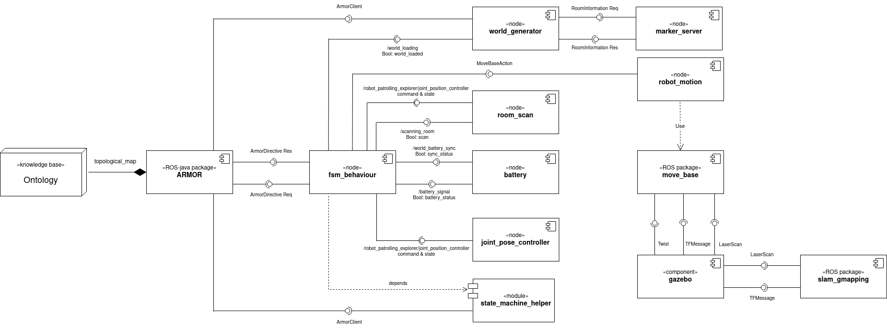

Surveillance Robot in indoors environment
=========================================

First ROS-based assignment for the Experimental Robotics Laboratory course at [University of Genoa](https://unige.it//).

Introduction
-----------------
This repository contains a software architecture ROS package for a surveillance robot menaged by a finite state machine, which builds the ontology and defines states to describe the robot's behavior. The architecture is described in the following sections.
The programming language used to develop this package is Python3 and several tools are also used, including:
1. [SMACH tool](http://wiki.ros.org/smach), to define the finite state machine;
2. [SMACH viewer](http://wiki.ros.org/smach_viewer), as debugging tool to see the states, transitions and behavior of the FSM in a graphical way;
3. [Protégé](https://protege.stanford.edu/) that consent to start the reasoning of the OWL ontology and to visualize the data and object properties of the individuals.

Finally, the whole architecture depends from the [aRMOR service](https://github.com/EmaroLab/armor) to use OWL ontologies in a ROS architecture.

The [project documentation](https://thomascampagnolo97.github.io/exprob_surveillance/), written in Sphinx, is available to this link.


Scenario Description
--------------------------
The project consists in creating the software architecture for a surveillance robot located inside an indoor 2D environment.  
The layout of the environment can be different but the structure remains the same. It has:
* 4 rooms (R1, R2, R3, R4);
* 2 corridors,(C1, C2);
* 1 special room (E), that can be considered also as corridor; 
* 7 doors (D1, D2, D3, D4, D5, D6, D7).

In a graphical way it can be schematized by the following image:



The robot's objective is to visit the different locations and stay there for some times.
In this repository the user will find an already designed [ontology map](topological_map/topological_map.owl) in which the robot will exploit the surveillance function. 
(As implemented in the ontology, the difference between a room and a corridor is that a corridor has more than one door allowing communication with multiple rooms.)

The robot starts in a pre-defined initial location `E` and waits until the topological map has been correctly initialized and defined.
Once the map is created and loaded, the robot moves to a new location and waits some time to simulate a surveillance task. Once the location has been explored, the robot visits another location.
If the battery of the robot is low, a charging procedure imposes on the robot to reach the charging location, which is the `E` corridor simulating a recharging task in that specific location. This means that the battery task takes priority over all other features
When the battery is fully charged, it will start from the task interrupted before.
When the robot's battery is not low, it moves in the environment according to the following surveillance policy:
* the robot stays mainly in `CORRIDOR`;
* if a reachable `ROOMS` has not been visited for some time, it becomes `URGENT` and the robot should visit it.
The urgency of one location is determined by computing the difference between the last time that the robot moved and the last time that the issued location has been visited. When this difference becomes higher than a `threshold`, the specific location becomes urgent.


Software Architecture
--------------------------

The software architecture of the project is explained in this section. First, the general organization of the repository and the dependencies are pointed out. Later on, will be discuss the architecture with the help of diagrams.

### Repository Organization

This repository contains a ROS package named `exprob_surveillance` that includes the following resources:
 - [CMakeLists.txt](CMakeLists.txt): File to configure this package.
 - [package.xml](package.xml): File to configure this package.
 - [setup.py](setup.py): File to `import` python modules from the `utilities` folder into the files in the `script` folder. 
 - [launch/](launcher/): Contains the configuration to launch this package.
    - [surveillance.launch](launcher/surveillance.launch): It launches this package with all the required nodes.
 - [scripts/](scripts/): It contains the implementation of each software component.
    - [fsm_behaviour.py](scripts/fsm_behaviour.py): It implements the finite state machine for the software architecture.
    - [world_generator.py](scripts/world_generator.py): It implements the generation of the environment.
    - [battery.py](scripts/battery.py): It implements the management of the robot's battery level.
 - [utilities/exprob_surveillance](utilities/exprob_surveillance/): It contains auxiliary python files, which are exploited by the files in the `scripts` folder.
    - [architecture_name_mapper.py](utilities/exprob_surveillance/architecture_name_mapper.py): It contains the name of each *node*, *topic*, and *parameters* used in this architecture.
    - [state_machine_helper.py](utilities/exprob_surveillance/state_machine_helper.py): It contains the methods called in the [fsm_behaviour.py](scripts/fsm_behaviour.py) node to make the code easier and cleaner to read.
 - [diagrams/](diagrams/): It contains the diagrams and the video shown in this README file.
 - [docs/](docs/): It contains the files to visualize the Sphinx documentation.
 - [topological_map/](topological_map/): It contains the ontology used in this software architecture.

### Dependencies

The software exploits [roslaunch](http://wiki.ros.org/roslaunch) and [rospy](http://wiki.ros.org/rospy) for using python with ROS. Rospy allows defining ROS nodes, 
services, and related messages.

The Finite States Machine using the software components provided in this repository is based on [SMACH](http://wiki.ros.org/smach).

It is possible to check the [tutorials](http://wiki.ros.org/smach/Tutorials) related to SMACH, for an overview of its  functionalities. In addition, it is advised to exploit the [smach_viewer](http://wiki.ros.org/smach_viewer) node to visualize and debug the implemented Finite States Machine.

Another dependency is [xterm](https://manpages.ubuntu.com/manpages/trusty/man1/xterm.1.html) which allows opening multiple terminals to have a clear view of what every single node does while the program is running.

FInally, [Armor](https://github.com/EmaroLab/armor) is essential in this project to use the ontology and ensure the desired behavior thought for the software architecture.

### State Diagram

The state diagram shows the finite state machine implemented in the code. The figure helps to understand the logic:

  

The state machine is composed by 4 states, which are:  
* `BUILD_WORLD`: state in which the Tbox of the ontology is loaded and then manipulated to create the desired environment according to the request. This state, depending by the external node `world_generator`, builds the Abox of the ontology and save it. This state subscribe to the topic `/world_loaded` that waits for the environment to be uploaded by the external node `world_generator`, which will publish `True` when the map is totally created. This will change a flag in the callback in the helper module `state_machine_helper.py` and will let the code go to the next state.  
* `NO_EMERGENCY`: this state represent the idle state of the robot. If there are no urgent rooms the robot will moving between the 2 corridors `C1` and `C2`.   
To menage the robots movement, updates the timestamps and find the optimal path with the function `path_planning`, the `motion_control` function is called to allow the robot to go from one `LOCATION` to another.  
In this state the *urgency flag* `urgency_status` and the *battery flag* `battery_status` are flags that modify the behavior of the finite state machine as they have high priority.
* `RECHARGING`: this state defines the case in which the robot battery is low. The `battery_status` flag is checked and if it's 0 the robot position will be changed to the `E` room and will stay there until the external node `battery`, perform the battery recharging operation and publish in the topic `/battery_signal` the value 1 of the flag, maintaining it for the entire duration of the discharge.
* `SURVEILLANCE`: this state is activated when one or more rooms are marked as `URGENT`. In this state, information about the time of the last visit to the room and the current time are compared. If this difference exceeds a certain time threshold then this room is classified as urgent and must be visited by the robot. Also in this state to menage the robots movement, updates the timestamps and find the optimal path with the function `path_planning`, the `motion_control` function is called to allow the robot to go from one `ROOM` to another. Once the list `urgent_rooms` is empty, i.e. when all urgent rooms have been visited by the robot, the `urgency_status` flag is set to 0 thus allowing the FSM to switch to `NO_EMERGENCY` status.

### Component Diagram

The component diagram shows the nodes/components that make up the architecture.

   

As shown in the diagram, there are 3 nodes and one module implemented for the software architecture. The additional node [aRMOR](https://github.com/EmaroLab/armor) is essential to guarantee the communication between the ontology, developed with the software [Protégé](https://protege.stanford.edu/), and the ROS scripts of this project.
The whole architecture can briefly described:
* `fsm_behaviour.py`: this node is the core of the whole architecture. Every other node communicates with this to ensure the correct behavior of the software. In this node, the finite state machine of the project is implemented, which initializes and manages the states mentioned above: `BUILD_WORLD`, `NO_EMERGENCY`, `RECHARGING` and `SURVEILLANCE`. In support to this node, an external module helper class was created in the `state_machine_helper.py` node that implements some methods called inside the `fsm_behaviour.py`.
* `battery.py`: this node manages the robot battery discharge and recharge operations through the dedicated functions. For a synchronization with the FSM this node starts executing the cycles just mentioned when the `sync_status` flag is set to 1 by the `fsm_behaviour.py` node. This means that the map has been loaded correctly and the discharge cycle can start as the robot can move between different locations. Furthermore, this node publishes on the topic `/battery_signal` a boolean value, the `battery_status` flag. This will retrieved by the subscriber in the `fsm_behaviour.py`. When `battery_status` is 0 the battery is low and the robot will change state to the `RECHARGING` one; instead if it is 1, the battery is fully recharged and the code will get back to the `NO_EMERGENCY` state and then to the task that was left when the battery died.  
* `world_generator.py`: also in this node there is a publisher function that uses the `/world_loading` topic and will modify the `world_loaded` variable flag. When it is 0 the FSM in `fsm_behaviour.py` is still waiting for the map, while when it's 1 the code will go to the `NO_EMERGENCY` state. 
This state will not be used anymore until the next run of the code.

The final ontology [world_surveillance](topological_map/world_surveillance.owl) is created using the [aRMOR Service commands](https://github.com/EmaroLab/armor/blob/master/commands.md).


Installation and how to run
-------------------------------

This software is based on ROS Noetic. First, install the dependencies coming from other ROS packages:
* [aRMOR](https://github.com/EmaroLab/armor) and
* [SMACH](http://wiki.ros.org/smach).

About ARMOR, if you have a new version of ROS installed on your machine, the suggestion is to follow this [aRMOR procedure](EmaroLab/armor#7).

Instead, if you have an older version of ROS, please refer to the previous one.

In both cases, the procedure explained in the README files should be followed and the needed repositories must be cloned and built in your ROS workspace.
Another toll is `xterm`. To use this feature the following installing instruction is needed:

```bash
sudo apt-get -y install xterm
```

After this, the clone of this repository must be done in the *src* folder of the user's ROS workspace and the package can be built typing the following commands in the terminal:

```bash
cd <ros_workspace_path>/src
git clone https://github.com/thomascampagnolo97/exprob_surveillance.git
cd ..
catkin_make
```

In this folder be sure that all the .py files are executables:
```bash
chmod +x <name_of_file.py>
```
Once the previous commands have been correctly executed it is possible to launch the program. 
To call the launch file and run the working code type:

```bash
roslaunch exprob_surveillance surveillance.launch
```
In total four terminal windows are going to be opened at the same time.
One corresponds to the `fsm_behaviour.py` node which gives visual feedback on what is happening during the execution of the software architecture. One terminal illustrates the execution done by the `battery.py`. Another one allows the visualization of the working procedure of the `world_generator.py`. The last shows the messages given by the aRMOR service.

If the user wants to see the transitions between the states, the SMACH viewer tool can be used. For this purpose type the following command in another terminal:
```bash
rosrun smach_viewer smach_viewer.py 
```

Package execution and video
------------------------
https://github.com/thomascampagnolo97/exprob_surveillance/assets/92585673/e6ce4a0e-3907-4520-896b-5c83a049bccf

In the main terminal, on the left, it is visible the execution of the `fsm_behaviour.py` node. This node implements the Finite State Machine and shows every transition from one state to another to achieve the desired behavior of the program. 
On the right, three xterm windows appear once the program is launched. The window at the top is shows the messages given by the aRMOR service. The one in the middle represents the `battery.py` node and shows the battery's level during the discharge and recharge cycle's and is responsible for generating the battery flag to signal when the battery is low. Finally, the one at the bottom is the `world_generator.py` and is responsible for generating the environment and publish the world flag.


Working hypothesis and environment
--------------------------------------
### System's features
The assumptions behind the development of this project were done to make an easier model of a surveillance robot:
* The robot moves in a 2D known environment without obstacles;
* Rooms have only one door and corridors have at least two doors. One location can only have one door shared with another location;
* The number of rooms, corridors, and doors is fixed;
* The robot can reach any location moving through common `connectedTo` positions;  
* The battery level does not keep into account the real behaviour level of charge of the battery. The signal is managed in a simulation manner;
* The battery signal can become low at any time, and the robot immediately reacts to this event;
* When a battery low signal comes, all the previous actions are stops, and delayed after the recharging procedure, imposing the robot to go to the charge location as next room to reach;
* The robot only simulates a surveillance task, so there is no actual surveillance of the environment and there are not sensors such as cameras.


### System's limitations

Most of the limitations derive from the hypothesis:
* The 2D environment constrains the map to be only on one floor. The structure is fixed with a pre-defined number of rooms, corridors, and doors;
* The robot states that a location is urgent only based on the timestamp for which the issued location has not been visited, not caring about other possible stimuli;
* The motion controler and planner takes time to compute the path;
* The environment is static. There are not dynamic objects such as person in the room and the robot cannot generate a reasonable path to go from one location to another;
* There is not any GUI with which the user could create his own map.

### Possible technical improvements

Some improvements would be to solve some limitations present in this system, like:
* Since the structure is fixed, there would be the need to change a bit the code to maintain a reasonable structure for an indoor environment if one of these numbers needs to be changed;
* Use of thread and mutex to prevent the overwriting of the global variables would make the architecture more reliable and robust.

Making some realistic assumptions, other improvements would be:
* 3D environment with no pre-determined structure;
* Robot equipped with sensors so that it could perform a surveillance action and not just simulate it;
* Implement a real battery behaviour of the robot.


Authors and contacts
--------------------------
Author: [Thomas Campagnolo](https://github.com/thomascampagnolo97)  
Email: thomas.campagnolo24@gmail.com  
Professors: [Luca Buoncompagni](https://github.com/buoncubi) and [Carmine Recchiuto](https://github.com/CarmineD8)